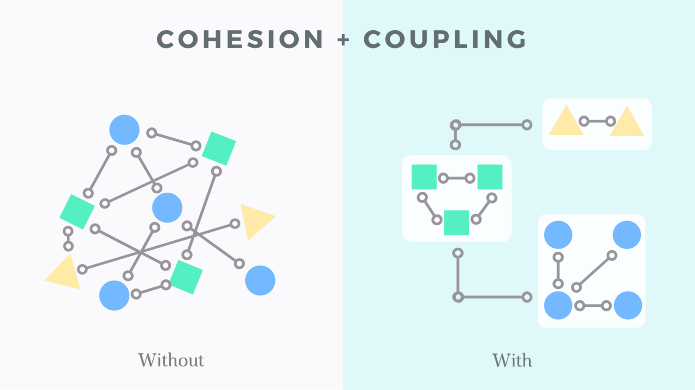
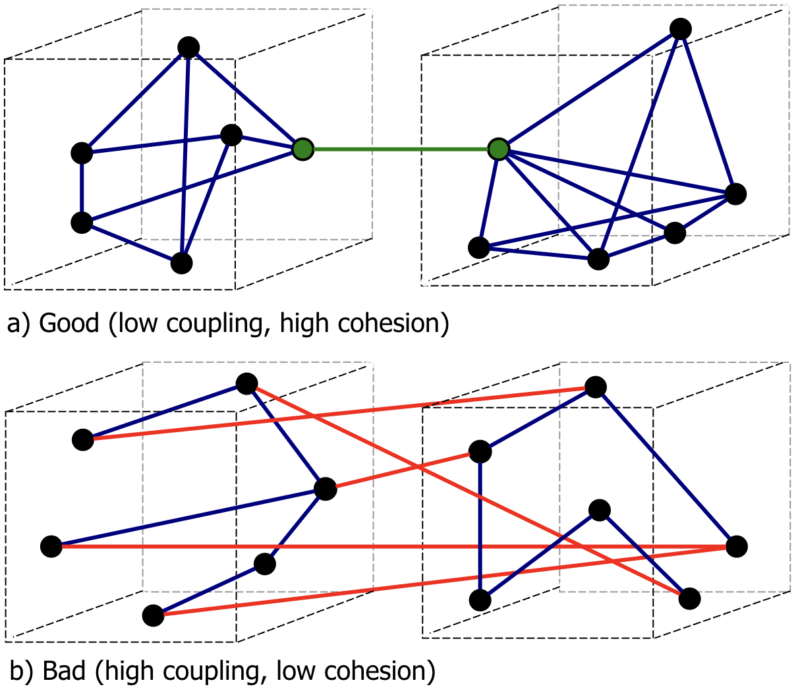

# GRASP

GRASP (General Responsibility Assignment Software Patterns) principles are a set of guidelines to follow when assigning responsibilities to classes and objects in object-oriented design. Let's discuss these principles with examples in TypeScript.

GRASP were created by Craig Larman in his 1997 book "Applying UML and Patterns".

The primary purpose of the GRASP principles is to help software developers and designers make informed decisions about how to distribute tasks and responsibilities across various components of a system, leading to more robust, maintainable, and reusable code.

GRASP was created by Craig Larman specifically for OOP or for another paradigms too?

GRASP was specifically created by Craig Larman for OOP. The principles focus on how to best assign responsibilities to classes and objects to create a well-structured, maintainable, and scalable object-oriented software system. While some principles such as Low Coupling and High Cohesion can be applied more broadly across different programming paradigms, GRASP itself is firmly rooted in the context of OOP.

1. Information Expert
2. Creator
3. Controller
4. Low Coupling
5. High Cohesion
6. Polymorphism
7. Pure Fabrication
8. Indirection
9. Protected Variations

These examples illustrate how GRASP principles can be applied using TypeScript to create a well-structured, maintainable, and extensible codebase.

# How to run file

`npm run run --file=1-information-expert.js`